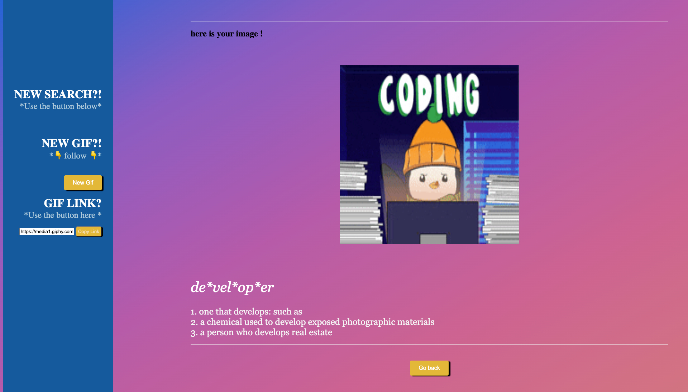

# Words-with-Memes

Our team designed and executed a fun, yet purposeful app that provides multiple options for entertainment and learning. The primary activity allows the user to input a word and get the definition of that word, along with a related GIF. It also presents an effective vocabulary builder if the user chooses the Randomizer button. Instead of specifying a word to be defined, the Randomizer button displays a GIF and definition without indicating which word is being defined. The user is given 4 words to choose from and prompted to select which word they think fits the GIF and provided definition best! Additionally, the app allows users to copy the link of the displayed GIF and easily share it on social media.

## Features:

   - Input a word and get its definition and a related GIF
   - Use the Randomizer button to guess the word of the provided   
   definition and GIF
   - Copy and share GIF links on social media    

## Team Members:

Milton Robles
Brad Hall
Mahogany Coleman
Yevette Hunt

## Motivation:

Our motivation behind creating this app is to infuse humor in the learning process. Humor can enhance dull methodology by tapping into multiple intelligences and learning styles in a way that spurs us to think in divergent, and real-life ways. A growing body of research suggests that, when used effectively, comedy can enhance a person's motivation to focus on the material, retain the information, and apply it in practical ways.

## APIs and Tools Used:

Our application utilizes two APIs: the Dictionary by Merriam-Webster, a trusted online dictionary for English word definitions, and Giphy Developers, an extensive GIF and video library. When a user inputs a word, our app sends a request to Merriam Webster API to retrieve the corresponding definition. The app simultaneously searches the Giphy API for an hilarious and relevant GIF. Both the GIF and definition are displayed to the user, providing a humorous and engaging way to learn the definition of new words. By leveraging the power of two APIs, our app provides a way to expand your vocabulary in a playful and addictive way.

The foundation of our application was created using PURE CSS, an existing set of small and responsive CSS modules, that we adapted to achieve the layout we envisioned. We loved the simplicity of PURE CSS and the ability to easily customize the modules. Our group faced a significant challenge with the PURE CSS framework in that we found that the styling did not display consistently across all of our operating systems due to display settings. We had to work together to diagnose the issues and come up with solutions. Ultimately we are happy with the look and feel of our application and have gained valuable experience using our Dev Tools in our Developers process.

We used the fetch method to make both API calls. Once the data is retrieved, we store it in local storage before rendering it to display for the user. Our goal in using local storage is to improve performance by reducing the number of API calls needed.

## Data Tailoring:

Calling the respective APIs and parsing the information required thoughtful focus. Both APIs returned information that we didn't necessarily need or find useful for our application. We've detailed below the specific ways that we tailored the data for our necessities.

## API's
The Giphy API:

We wanted our app to be an option for all ages and realized pretty early that not all GIFs are appropriate for everyone. But by implementing Giphy's content rating system, we are more likely to return GIFs friendly for general audiences. 
Additionally we wanted to showcase the most relevant GIFs, and while the Giphy API is seemingly endless in the GIF supply, the more GIFs returned, the less likely that the GIF would be relatable to the defined word. To address this issue, we wrote an array slice into our code to only return the first, or top 10 gifs. 

The Merriam-Webster API:

The challenge with the API call to the dictionary by Merriam Webster is the amount of information that was returned. In the future we may decide to include some additional information like synonyms or antonyms but for this release we wanted to keep it simple and only supply the most widely used definitions. We accomplished this by structuring the response to extract and display only the first few definitions of the word.

## Most Challenging Aspect:

A special feature of this project is the option to select the Randomizer button and guess the word of the provided definition and GIF. This was a promising idea that we resolved to explore with no idea we would be able to accomplish it. It involves carefully crafted code that features a flag on an event listener. It sets the parameter as a boolean value that specifies whether the event listener should execute during the capture phase or the bubbling phase. In Javascript the events propagate from, or "bubble" up the DOM tree from the target element to its parent elements. The default is execution during the bubbling phase, on the target element first and then its parent elements. However, by setting the flag to 'true', you can execute the event listener in the capture phase instead. In this way events propagate from the top of the DOM tree down to the target element, bypassing the target element which in this case would result in the vocabulary quiz instead of the specified word definition.

## Future Improvements:

In the future, we would like to match the GIFs more closely with the actual definition, rather than the word itself. As the app works currently, the API calls are made simultaneously. We encountered a few words where the definition and the GIF image do not closely match. We believe if the dictionary API was called first and then the GIF was called using the string of words in the definition, it would solve this problem and provide increased value to our application as a learning tool.

## Acknowledgements:
    PURE CSS for the Framework
    The Dictionary by Merriam-Webster API
    The Giphy API
    Font Joy
    Colorspace

## Contact:
   - Milton Robles https://github.com/mrobles-dev
   - Brad Hall https://github.com/Bradfh
   - Mahogany Coleman https://github.com/mahog874
   - Yevette Hunt https://github.com/yveivy

## Deployed Site:
https://yveivy.github.io/Words-with-Memes/

 *For more information on the benefits of humor in education, see the following references:
 https://www.nature.com/articles/nn0301_237#citeas
 https://www.nature.com/articles/nrn1406#citeas
 https://doi.org/10.1080/03634523.2010.496867
 https://doi.org/10.3200/CTCH.54.1.177-180
 https://doi.org/10.1080/03634520903367238

[def]: "./"